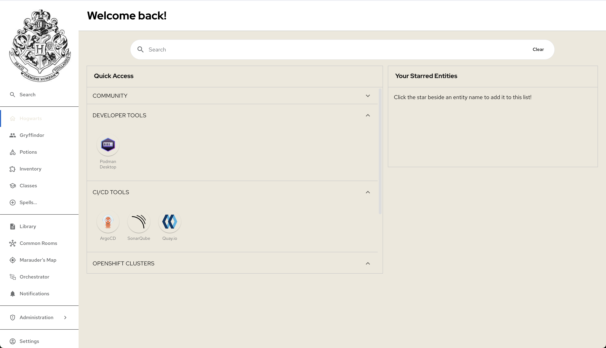

# Developer Hub custom theming
**Disclaimer:**_Version 1.4 of Developer Hub got used for this demo, which is already a bit dated.
If you are going to use it on a newer version, the configuration could look slightly different, 
but you can reach out when you're stuck._

## File
* **01_change_theme.yaml**:   
The app config of Developer Hub to change the theme towards a Hogwards theme, which aligns better 
with our Harry Potter talk branding.
* **01_backstage-rhtap-values.yaml**:  
Same content as the one above, but this one can be used to apply the Hogwards theme via GitOps 
(used by ArgoCD in our demo environment).

## Theme
Applying the theme should result in the following layout:
